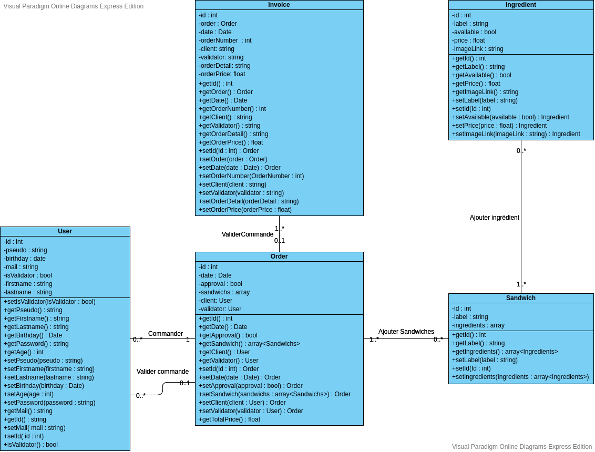

# La Sandwicheriie : présentation générale du projet

## Problématique
L’association SandwicherIIE de l’ENSIIE propose des sandwichs tous les midis. Cependant, il n’y avait pas de plateforme pour commander en ligne. Un sandwich unique tous les midis : l’association ne proposait qu’un seul et unique sandwich par jour. 
Cela limitait le choix pour celui voulant profiter du repas. La communication sur les commandes était approximative. Il fallait envoyer un message pour détailler la commande avec les ingrédients. Pas de barman = pas de repas. Il fallait avoir obligatoirement un barman pour préparer et stocker les ingrédients. En cas d’absence, impossible de faire un sandwich digne de ce nom. 

## Objectif du projet
Répondre aux problématiques évoquées et proposer une application pour simplifier et ouvrir la SandwicherIIE à tous.

## Solution proposée
Réaliser une application web simple et moderne qui se démarque de la concurrence avec notre système de personnalisation de Sandwich.

# Présentation technique
## Frontend
Application web réalisé en php + framework bootstrap.
6 écrans disponibles:
* création de compte
* connexion
* commande
* gestion du panier
* validation
* back office

## Backend

## Methode pour lancer le projet
This tutorial will guide you through the installation procedure of the Web Project Skeleton.   

The only packages you need to install right now are **docker** and **docker-compose**
* [Install Docker](https://docs.docker.com/install/)
* [Docker w/o sudo](https://docs.docker.com/install/linux/linux-postinstall/)
* [Install Docker Compose](https://docs.docker.com/compose/install/)

Then, clone the Web Project skeleton on your machine:
* `git clone https://github.com/rparpa/ensiie-project.git`
* `cd ensiie-project`

The next step is to set some environment variables in the `.env` file
* Open this Skeleton on your favorite IDE : PHPStorm or VSCode.
* Open the file .env
    * DOCKER_USER_ID: to obtain the value of this variable you need to execute this command `$(echo id -u $USER)` on a Terminal. Copy and past the output.
    * REMOTE_HOST: For those who want to use the PHPStorm Debugger, put your IP address. Otherwise, skip this step.

Now, let's begin the installation :
* `make install`. This command may take time.  
* That's it! Your website is running [http:localhost:8080](http:localhost:8080)

Below are some useful commands :
* `make stop` Stop the containers
* `make start` Start the containers
* `make db.connect` Connect to th database
* `make phpunit.run` Run the PHPUnit tests
* `make install` Reinstall all containers

## Diagramme de classe

* ``