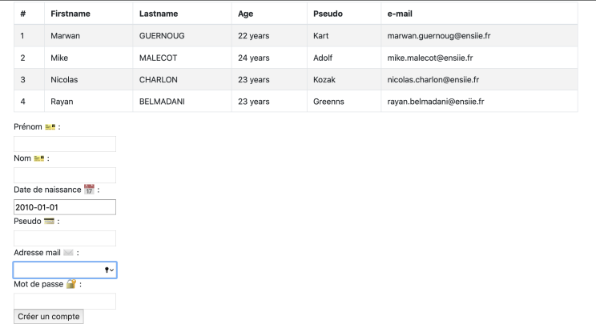

# La Sandwicheriie

## Install your application
This tutorial will guide you through the installation procedure of the Web Project Skeleton.   

The only packages you need to install right now are **docker** and **docker-compose**
* [Install Docker](https://docs.docker.com/install/)
* [Docker w/o sudo](https://docs.docker.com/install/linux/linux-postinstall/)
* [Install Docker Compose](https://docs.docker.com/compose/install/)

Then, clone the Web Project skeleton on your machine:
* `git clone https://github.com/rparpa/ensiie-project.git`
* `cd ensiie-project`

The next step is to set some environment variables in the `.env` file
* Open this Skeleton on your favorite IDE : PHPStorm or VSCode.
* Open the file .env
    * DOCKER_USER_ID: to obtain the value of this variable you need to execute this command `$(echo id -u $USER)` on a Terminal. Copy and past the output.
    * REMOTE_HOST: For those who want to use the PHPStorm Debugger, put your IP address. Otherwise, skip this step.

Now, let's begin the installation :
* `make install`. This command may take time.  
* That's it! Your website is running [http:localhost:8080](http:localhost:8080)

Below are some useful commands :
* `make stop` Stop the containers
* `make start` Start the containers
* `make db.connect` Connect to th database
* `make phpunit.run` Run the PHPUnit tests
* `make install` Reinstall all containers

