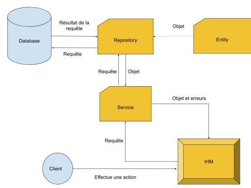

# La Sandwicheriie : présentation générale du projet

## Problématiques
L’association SandwicherIIE de l’ENSIIE propose des sandwichs tous les midis. Cependant, il n’y avait pas de plateforme pour commander en ligne. Un sandwich unique tous les midis : l’association ne proposait qu’un seul et unique sandwich par jour. Cela limitait le choix de nos clients.

La communication sur les commandes était approximative, il fallait envoyer un message pour détailler la commande avec les ingrédients.

Pas de barman = pas de repas. Il fallait avoir obligatoirement un barman pour préparer et stocker les ingrédients. En cas d’absence, impossible de faire un sandwich digne de ce nom. 

## Objectif du projet
Répondre aux problématiques évoquées et proposer une application pour simplifier et ouvrir la SandwicherIIE à tous.

## Solution proposée
Réaliser une application web simple et moderne qui se démarque de la concurrence avec notre système de personnalisation de Sandwich.

# Présentation technique

## lien vers le trello : https://trello.com/b/rhdYqTJR/sandwicheriie

## Frontend
Application web réalisé en php + framework bootstrap.
6 écrans disponibles:
* création de compte
* connexion
* commande
* gestion du panier
* validation
* back office

## Backend
Le projet est composé de 5 entités, 5 repositories, et 4 services.

Les entités sont soumises aux contraintes du schéma de classe ci-dessous :
* La classe ingrédient est portée par la classe sandwich.
* La classe sandwich est portée par la classe commande (order).
* La classe facture (invoice) est portée par la classe commande.
* La classe user est portée par la classe commande.

Les points d’accès à la base de données se situe dans les repository correspondant à chaque entité :
* Ingrédient : CRUD
* Sandwich : CRD
* Facture : CR
* Commande : CRD (+validation de commande mais pas d’update)
* User : CRUD

Les points d’entrés de ses objets sont situés dans les services suivants avec les contrôles rattachés :
* Le service d’ingrédient responsable de créer, supprimer, mettre à jour, récupérer les ingrédients.
* Le service de commande responsable de créer, supprimer, valider, récupérer les commandes. La récupération et la création se font en cascade avec les objets portés (e.g.: création de sandwich dynamique en fonction des ingrédients portés)
* Le service de facture responsable de récupérer une ou plusieurs  factures.
* Le service d’utilisateur responsable de créer, supprimer, mettre à jour, récupérer les utilisateurs.

## Patterns

Nous avons utilisé plusieurs patterns pour venir à bout de nos challenges techniques.

Deux patterns d’architectures notables :

* Architecture orientée service : un ensemble de services nous permet d’assurer la résilience de l’application aux appels utilisateur. Cet ensemble de services regroupe les besoins structurels du projet (couche business & contrôle des entrées utilisateurs). 
Ce pattern nous permet de structurer à la fois la requête de l’utilisateur mais aussi les erreurs ou les appels à la couche de persistance en fonction de règles business (e.g.: création de la facture à la validation de la commande)

* Repository : un ensemble de classes se charge de persister les données en base. Cette couche s’assure uniquement du bon fonctionnement des appels en base mais pas du contrôle des données utilisateurs. Cette couche nous permet de charger en cascade des objets. Chaque objet du type A  portant une relation avec un objet du type B peut alors charger l’objet couplé B avec le repository de l’objet B dans le repository de l’objet A. (e.g.: chargement de l’objet commande)

* Pattern builder pour instancier nos objets en un seul appel pour faciliter la lecture de code.

## Diagramme de classe

## Methode pour lancer le projet
This tutorial will guide you through the installation procedure of the Web Project Skeleton.   

The only packages you need to install right now are **docker** and **docker-compose**
* [Install Docker](https://docs.docker.com/install/)
* [Docker w/o sudo](https://docs.docker.com/install/linux/linux-postinstall/)
* [Install Docker Compose](https://docs.docker.com/compose/install/)

Then, clone the Web Project skeleton on your machine:
* `git clone https://github.com/rparpa/ensiie-project.git`
* `cd ensiie-project`

The next step is to set some environment variables in the `.env` file
* Open this Skeleton on your favorite IDE : PHPStorm or VSCode.
* Open the file .env
    * DOCKER_USER_ID: to obtain the value of this variable you need to execute this command `$(echo id -u $USER)` on a Terminal. Copy and past the output.
    * REMOTE_HOST: For those who want to use the PHPStorm Debugger, put your IP address. Otherwise, skip this step.

Now, let's begin the installation :
* `make install`. This command may take time.  
* That's it! Your website is running [http:localhost:8080](http:localhost:8080)

Below are some useful commands :
* `make stop` Stop the containers
* `make start` Start the containers
* `make db.connect` Connect to th database
* `make phpunit.run` Run the PHPUnit tests
* `make install` Reinstall all containers

